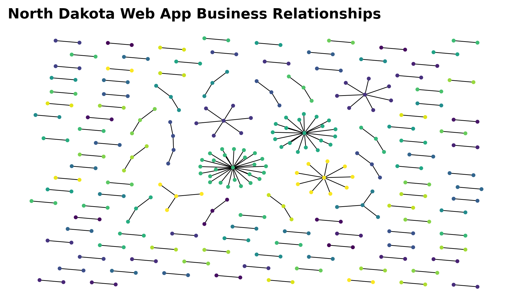
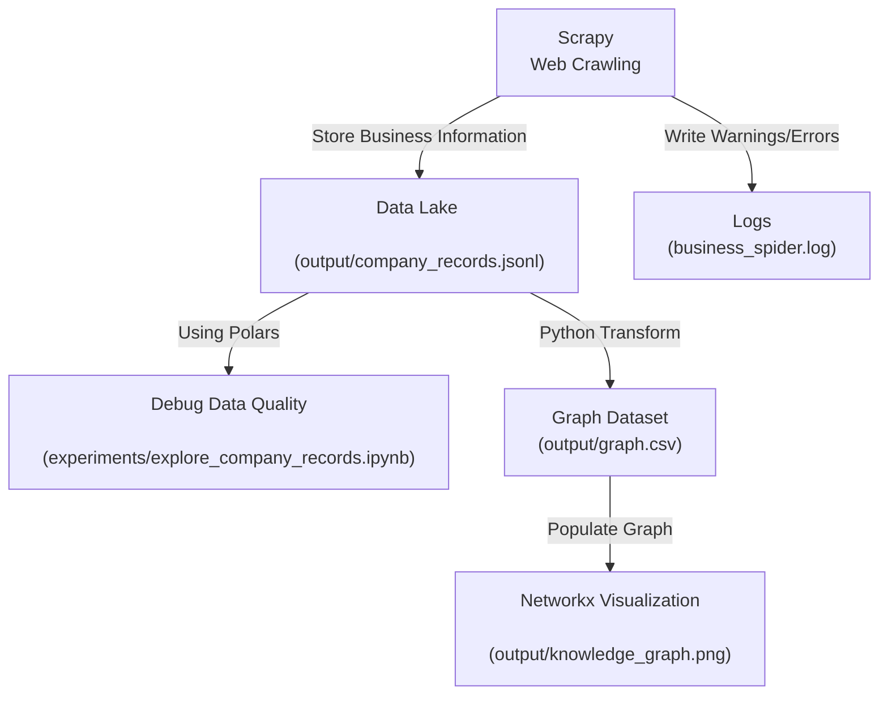

# Sayari Data Task
## About


This public repo is my submission for Sayari's Data Task. The goal of this challenge is to complete the following data engineering tasks:
- [x] Web crawl relevant business information from [North Dakota Secretary of State Web App](https://firststop.sos.nd.gov/search/business). 
- [x] Store results in appropriate file formats for downstream analysis.
- [x] For this assessment, the downstream task is to plot a network graph of businesses, demonstrating relationships between businesses and their **Commercial Registered Agents, Registered Agents and Owners**. 

Some additional tasks were done to ensure data quality, code reproducibility and ease of development, qualities very important to production engineering pipeline:
- [x] Configured Dockerfile for reproducible code.
- [x] Configured Makefile to easily run Dockerfile builds, mounts and executions.
- [x] Performed Spark-like transformations and queries using Polars on web crawling output to debug data quality concerns revealed from web crawling logs. 

## Directory Structure
```
├── Dockerfile # Coding environment reproducibility.
├── Makefile # Automate docker container build and runs.
├── README.md
├── experiments # Playground for trying out web scraping requests and python libraries such as jmespath.
├── output
│   ├── company_records.jsonl # Web crawled results.
│   ├── graph.csv # Structured graph data.
│   └── knowledge_graph.png # Output network graph.
├── requirements.txt
├── sayari_graph_scraping
│   ├── __init__.py
│   ├── items.py # Defines Scrapy data models (Did not use for this assessment).
│   ├── middlewares.py Downloader/spider middlewares (Did not use for this assessment).
│   ├── pipelines.py # runs postprocessing pipeline. Used to generate networkx visualization after crawler has gathered data.
│   ├── postprocess.py # Custom postprocess script to generate networkx visualization when crawling data is already staged.
│   ├── settings.py # Configures crawler rate limit and other configurations.
│   ├── spiders
│   │   ├── __init__.py
│   │   └── sayari_spider.py # Spider responsible for following links and acquire data through web crawling
│ 
├── scrapy.cfg
└── test
    └── test_random.py
```

## Methodology

I will break down key features of my design responsible for scalable, fault-tolerant data engineering pipeline.

### Web Crawling
1. **Requests and Link Follows.** Used the IDs extracted from initial API call to get web app tables to query drawer information. This allows all relevant business information to be retrieved. For requests **Accept** and **Content-Type** flags were configured to respectively communicate desired response data types and request payload data, as well as other headers such as **Authorization**. A minimally acceptable header size was decided using JavaScript knowledge and testing API requests in Postman. See Postman workspace [here](https://www.postman.com/cryosat-astronaut-55406376/my-workspace/collection/26y6zr0/sayari?action=share&creator=29483381) where I tested the requests. 
2. **Log warnings [(logged at business_spider.log)](business_spider.log) + Code Resilience** These were crucial for debugging unexpected data structures and improving adaptability of web crawling code. For example, an additional field **OWNERS** was discovered to be required for graph analysis, with the help of logs capturing moments when drawer information did not hold expected graph labels: OWNER_NAME, COMMERCIAL_REGISTERED_AGENT, OR REGISTERED_AGENT. It was also important for these warnings to act as warnings and not errors, to encourage fault tolerance and prevent failing entire crawling processes due to single point of failure. [Click for my data quality exploration notebook](experiments/explore_company_records.ipynb).

3. **Rate_limiting**
Autothrottling was configured in [sayari_graph_scraping/settings.py](sayari_graph_scraping/settings.py) to adjust request rates based on North Dakota Financial Web App's rate limiter. A robots.txt was not discovered on their website so arbitrary min and max request delays were set.

### Data Model
1. **Data Lake Format.** The data crawled by our spider is initially stored in .jsonl format [\(Link to data\)](output/company_records.jsonl). From eye test, it looked like drawer details has unpredictable schema, so .jsonl was opted to store web crawled results and hold unstructured data. Drawer details are stored in an array under the key "DRAWER_DETAILS". Also note that for each business, a new data field originally not returned from API request was derived, **KEY_ID**, to cater data format for .jsonl storage.
```javascript
    ## Initial
    {
        KEY_ID: {
            ...business_metadata
        }
    }

    ## After processing
    {
        ...business_metadata,
        KEY_ID
    }
```


2. **Graph Data Format** The graph dataset is stored in .csv format [\(Link here\)](output/graph.csv).
It contains network graph data format derived from in the following schema, expressed using Postgres DDL. The table can be interpreted as such: **entity** has a **relationship** with **company**. For example, **A (entity)** is the registered commercial agent (relationship) of **B (company)**. 
```sql
    CREATE TABLE graph (
        entity TEXT,
        company TEXT,
        relationship TEXT
    )
```
Each of the text columns go through simple preprocessing. Here's how it's done for each column:
- **entity**  Retrieve string before first "\n" (for strings without \n, this is just the entire string), Upper Case, Stripped, Contiguous Spaces Replaced with One Space

- **company** Upper Case, Stripped, Contiguous Spaces Replaced with One Space.

- **relationship** Upper Case, Replace Contiguous Spaces with One Underscore.


More complex processing could be done in the future, such as Levenshtein distance to
normalize strings. 


### Data Quality
As mentionned, [Click for my data quality exploration notebook](experiments/explore_company_records.ipynb) for more information. 

Data quality problems won't be explored in detail in README, but here are the general issues that were found and resolved:
- Additional **OWNERS** field needs to be processed from initially expected graph fields: **OWNER_NAME, COMMERCIAL_REGISTERED_AGENT, OR REGISTERED_AGENT.** Recall this issue was only discovered with the help of web crawling logging. *Solution*: rewrite code to add OWNERS field **AND** subsequent dictionaries in drawer that has "" empty string label to the resulting network graph. 
- POST request for companies whose titles start with X return some companies whose title do not start with X. *Solution:* filter for company titles using string operations (startswith).
- Multiple owner names delimited by commas under OWNER_NAME field in drawer. Only happens for company Xtravagant Elegance with SOS CONTROL ID# of 5852807. *Solution:* No solution to fix this yet, maybe the owner could have multiple names. Better contact stakeholders for this.

Even though these issues are considered resolved for now, it's important to have good code design and stay alert of future problems.

### Data Visualization
> [Link to Vis](output/knowledge_graph.png)

Based on the graph data model, a networkx graph visualization was generated. The graph is divided into connected components and each set of connected components is assigned a colour. With the help of neato graphviz positioning, registered agents and owner hubs and authorities were revealed through the networkx graph. 

Installing graphviz on windows was painstakingly hard, which was one of my motivations for building a docker container for reproducing code, so future developers wouldn't have to deal with the installation process.

## Running/Reproducing the Results

There are a few options for reproducing results
### Makefile + Docker (Recommended)
Simply running ```make``` in the terminal in root directory will build the docker container and run the entire crawling process as shown in [methodology](#methodology)

You can specify ```make run``` or ```make crawl``` to skip the build.

Or if you already web crawled, you can just run ```make postprocess``` to build graph dataset and generate visualization.

### Virtual Environment
You can also set up a virtual environment yourself. Google how to set one up, there arem any ways, and once you've activated the environment, run the following code to install packages.
```bash
    pip install -r requirements.txt
```
To run entire crawling process:
```bash
    scrapy crawl business_spider
```
And last but not least, if you already have web crawled data stored, just run the postprocessing script:
```bash
    python sayari_graph_scraping/postprocess.py
```

## Future Work
- [ ] Test data lake modeling and graph data modeling in postgres with docker-compose, to prepare for cloud deployments (ex. Kubernetes, RDS, S3). We are already going in the right direction with Dockerfiles.

- [ ] Consult stakeholders on desired data lake format. The field labels returned from API aren't exactly the same as what's shown on UI, (ex. SOS Control ID on UI is shown as RECORD_NUM in the API), so we need to understand the desired data schema and make necessary changes.

- [ ] Consult stakeholders to improve network visualization. For example, they might want colour for each type of node (ex. is it a registered agent? company? owner?) instead of just a colour for each connected component.

- [ ] Improve string preprocessing for entity resolution, since simple preprocessing may not be enough to normalize all names. 

- [ ] Create custom commands in Makefile to run Jupyter Notebook data quality exploration in Docker. That way developers can play around and check my analysis. 

